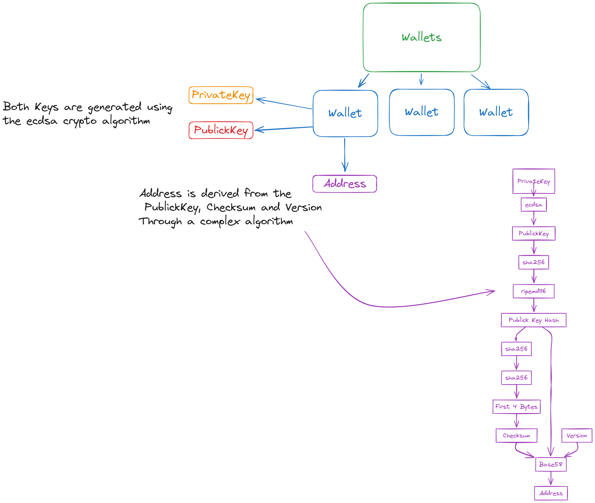

# Blockchain

Full implementation of a blockchain in Golang with a full network of nodes and persistent storage.

## Design

## Network API Specification

TCP-based API for interacting with the blockchain network. The network uses custom commands and binary encoding for data transmission.

## Protocol

- **Protocol**: TCP
- **Version**: 1

## Encoding

- **Encoding**: Data is encoded using Go's `gob` package for serialization.

## Commands

| Command   | Description                                          | Payload                                                                                     | Response               |
|-----------|------------------------------------------------------|---------------------------------------------------------------------------------------------|------------------------|
| `addr`    | Share known nodes with a new node.                   | `AddrList`: List of known node addresses.                                                   | None                   |
| `block`   | Send a block to another node.                        | `AddrFrom`: Address of the sender.   `Block`: Serialized block data.                     | None                   |
| `getblocks` | Request a list of block hashes from another node.    | `AddrFrom`: Address of the requester.                                                       | `inv` command with block hashes. |
| `getdata` | Request specific data (block or transaction).        | `AddrFrom`: Address of the requester.   `Type`: `block` or `tx`.   `ID`: Data ID.     | `block` or `tx` command with requested data. |
| `inv`     | Advertise inventory of blocks or transactions.       | `AddrFrom`: Address of the sender.   `Type`: `block` or `tx`.   `Items`: List of IDs. | None                   |
| `tx`      | Send a transaction to another node.                  | `AddrFrom`: Address of the sender.   `Transaction`: Serialized transaction data.         | None                   |
| `version` | Exchange version information and blockchain height.  | `Version`: Protocol version.   `BestHeight`: Blockchain height.   `AddrFrom`: Sender. | Potential `getblocks` or `version` response. |

## Transactions

## Wallets

## UTXO
Unspent Transaction Output

## Merkle Tree

## References
- [Tensor Programming's](https://www.youtube.com/watch?v=aE4eDTUAE70&list=PLJbE2Yu2zumC5QE39TQHBLYJDB2gfFE5Q&index=2&ab_channel=TensorProgramming) 